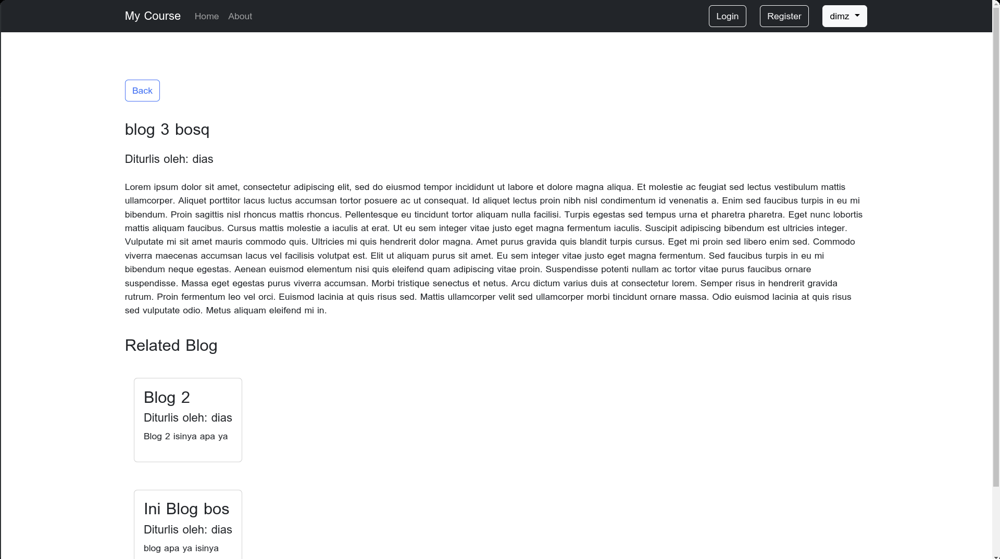
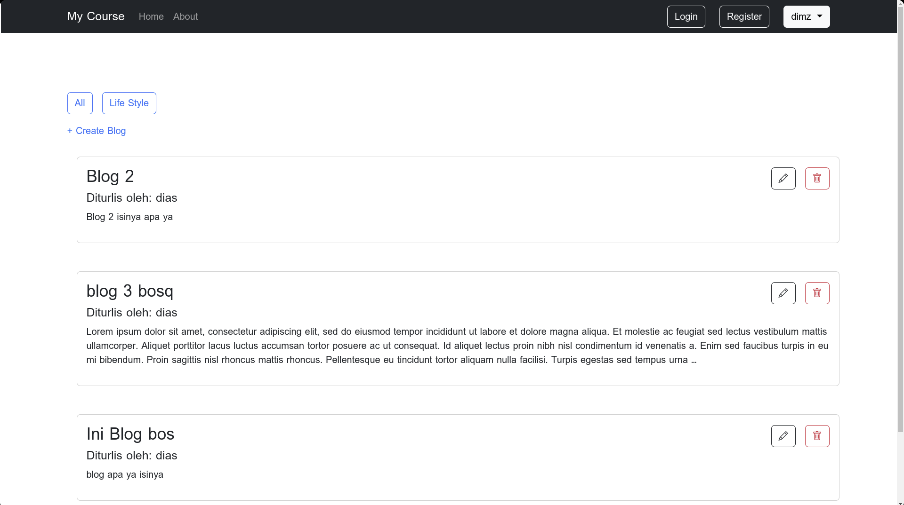
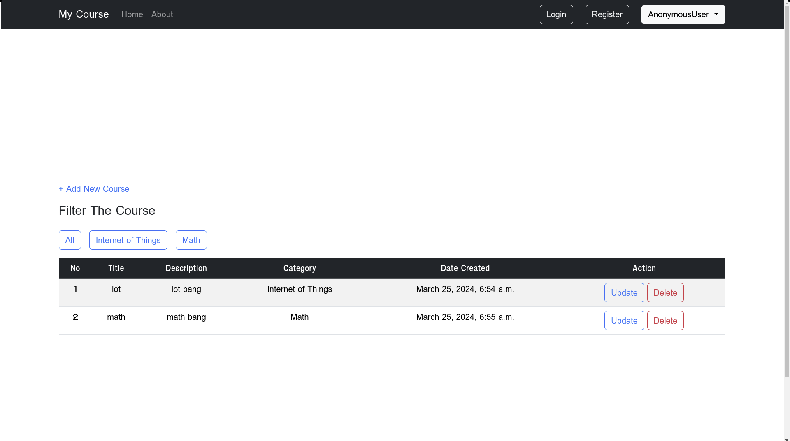

# For Notes Taking Only

> [!NOTE]
>
> - This env config is setup for linux user
> - I use MySQL for DBMS. It's configured on `settings.py`

## Get Things Done

- [x] Django Architecture with MVT
- [x] CRUD, Search, Filter
- [x] Function and Class Based View
- [x] Authenticate & Authorization (Permission Request)
- [ ] Rest API
- [ ] Payment Method

## Samples

